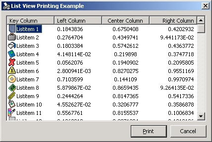



## List View Print

### Description

Adds printing functionality to the windows list view control(report view). Self contained routine to provide a print facility to the list view control. Lots of features - page numbering, small icon printing, column alignment to name but a few.

No API calls used though comments have been kept to a minimum.

My first upload to planetsc. I may extend this routine if feedback is constructive. Free for private use only - please contact me is you wish to use this code elsewhere.
 
### More Info
 
ListView to be printed and an optional heading report heading.

Should work on all printers though not tested on all :)

             |
---                |---
**Submitted On**   |2002-03-14 16:47:58
**By**             |[Paul Jones](https://github.com/Planet-Source-Code/PSCIndex/blob/master/ByAuthor/paul-jones.md)
**Level**          |Intermediate
**User Rating**    |4.8 (62 globes from 13 users)
**Compatibility**  |VB 5\.0, VB 6\.0
**Category**       |[Custom Controls/ Forms/  Menus](https://github.com/Planet-Source-Code/PSCIndex/blob/master/ByCategory/custom-controls-forms-menus__1-4.md)
**World**          |[Visual Basic](https://github.com/Planet-Source-Code/PSCIndex/blob/master/ByWorld/visual-basic.md)
**Archive File**   |[List\_View\_621153142002\.zip](https://github.com/Planet-Source-Code/paul-jones-list-view-print__1-32681/archive/master.zip)

